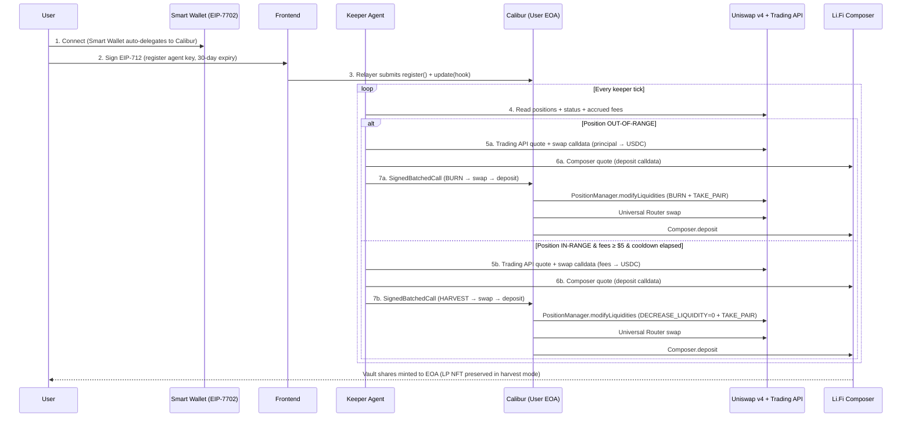

<p align="center">
  
</p>

<h1 align="center">Moai</h1>

<p align="center">
  Autonomous Uniswap LP rebalancer — delegate once, your Uniswap positions never go idle again.
</p>


---

MOAI is an agentic liquidity manager built on top of **Uniswap v3 + v4**. Users delegate to a keeper agent with a single EIP-712 signature; the agent watches their Uniswap positions and runs in **two complementary modes** — Migrate (when out-of-range) and Harvest (when in-range and accruing fees). Both modes route through the **Uniswap Trading API + Universal Router** and settle in **one atomic Calibur batched transaction** on Base, with the relayer paying gas. Uniswap is the substrate; the agent is the worker that keeps it productive.

> **Same agent. Two modes. One rule: your liquidity should never sleep.**
>
> - **In-range LP** → MOAI **harvests accrued fees** every 24h, swaps to USDC via Trading API, deposits to the best Earn vault. **Your LP stays live.**
> - **Out-of-range LP** → MOAI **migrates** the position: burn → swap → vault deposit, all atomic.

---

## What Makes MOAI Special

### Who This Is For

Meet Andre. He's been LP'ing on Uniswap v4 since launch, sitting on $40k of concentrated ETH/USDC liquidity. The fees were great — for the first two weeks. Then ETH ripped 22% in a day, his range got blown out, and his position has been earning exactly zero since.

Andre knows what he _should_ do: burn the LP, rebalance, redeploy. But that means tracking 6 separate positions across two chains, watching prices at 3am, paying gas on every leg, and trusting himself to not click the wrong button on the v4 PositionManager. So instead, he just… leaves it. Idle. For weeks.

He tried JIT bots — too aggressive, ate his fees. He tried a "set-and-forget" yield aggregator — they don't even support v4. He tried automating it himself with Foundry scripts — works for one position, breaks the moment he adds a second.

Andre's problem isn't a missing tool. It's that there's no platform where an autonomous agent _watches his positions_, _decides when to act_ based on his risk profile, and _executes a multi-leg migration_ in one atomic batch — without him surrendering custody of his funds.

---

### The Problem

Concentrated liquidity is a part-time job. Once a Uniswap v3/v4 position drifts out of its tick range, fees stop accruing immediately — but capital stays locked, earning nothing. The LP has to actively burn, swap, and redeploy to either a new range or a different yield source. That's three transactions, three approvals, three gas payments, and a real risk of a fat-finger somewhere along the way.

The existing tooling falls short:

- **Manual rebalancing** — gas-expensive, time-sensitive, requires the LP to be online and paying attention 24/7
- **Custody-based vaults** (Arrakis, Gamma, etc.) — user surrenders the LP NFT to a smart-contract vault; lose direct ownership, opt-in to the vault's strategy, can't migrate to non-Uniswap yield
- **JIT/MEV bots** — aggressive, often eat into LP fees, not aligned with passive holders
- **Single-purpose scripts** — work for one wallet, one pair, one strategy; break the moment scope expands

And none of them coordinate execution across users to get a better swap quote, or use a session-key model where the user retains full ownership.

**How might we build an LP-management agent that runs autonomously, executes complex multi-leg migrations atomically, and never holds the user's funds?**

---

### The Solution

MOAI solves this with six core primitives built on top of the Uniswap stack:

**1. EIP-7702 Session Keys via Calibur** — One EIP-712 signature registers a 30-day keeper key on the user's EOA via the **Calibur singleton — Uniswap's official EIP-7702 implementation** (`0x000000009B1D0aF20D8C6d0A44e162d11F9b8f00`). No on-chain delegation tx, no gas. The key is scoped by a `CaliburExecutionHook` that whitelists exactly the Uniswap PositionManager + Universal Router selectors MOAI is allowed to execute.

**2. Atomic Uniswap-Native Migration (out-of-range)** — When a position goes out of range, MOAI builds a `SignedBatchedCall` containing all legs: native **Uniswap v4 actions (`BURN_POSITION` 0x03 + `TAKE_PAIR` 0x11 + `SWEEP` 0x14 for ETH-native pools)** → ERC20 `approve` for Permit2 → **Uniswap Trading API `/quote` + `/swap` calldata routed through Universal Router** → `approve` Li.Fi → vault deposit. The user's wallet stays untouched; one transaction, one tx hash, one BaseScan link.

**3. Atomic Fee Harvest (in-range) — `NEW`** — When a position is healthy and earning, MOAI doesn't just sit there. Every 24h (or on a manual trigger), the agent harvests **only the accrued fees** using v4 `DECREASE_LIQUIDITY(liquidity = 0)` (or v3 `NonfungiblePositionManager.collect()`), then swaps non-USDC fees to USDC via the **Uniswap Trading API**, and deposits the result into the best Earn vault. The LP **stays live** — Uniswap TVL is untouched, fees compound into yield instead of sitting idle. Same Calibur batched-call architecture as migration; only the first leg differs.

**4. Risk-Profile-Driven Vault Selection** — Three profiles (Conservative / Balanced / Aggressive) drive a different protocol allowlist for the destination Earn vault, used by both migrate and harvest modes. Conservative routes to the highest-TVL bluechip (Aave, Compound, Lido); Balanced picks best APY across Morpho/Aave/Compound; Aggressive maximizes yield across Pendle, Ethena, Yearn, Euler, EtherFi.

**5. Relayer-Funded Gas** — A keeper hot wallet submits the batched tx and pays gas. The user's EOA pays nothing for the migration or harvest itself — fees are deducted from accrued LP fees / yield over time, not from principal.

**6. Funds Never Leave Custody** — Calibur runs as the user's EOA bytecode under EIP-7702. There is no smart-contract vault holding LP NFTs, no proxy custodian, no withdrawal queue. The agent has a key; the user always owns the EOA.

---

## Dual-Mode Strategy

MOAI runs two complementary, mutually-exclusive modes per position. The keeper picks the right mode every tick — no user input required.

|  | **Migrate Mode** | **Harvest Mode** |
|---|---|---|
| **Trigger** | Position is **out-of-range** | Position is **in-range** AND accrued fees ≥ `$5` (env-tunable) |
| **First leg** | `BURN_POSITION` (v4 action `0x03`) — destroys the LP NFT, returns principal + fees | `DECREASE_LIQUIDITY(liquidity = 0)` (v4 action `0x01`) **or** v3 `collect()` — settles fees only, LP NFT untouched |
| **Subsequent legs** | `TAKE_PAIR` → Permit2 approve → Trading API swap → Li.Fi approve → Composer deposit | (same downstream legs — only the first leg differs) |
| **Cooldown** | `KEEPER_COOLDOWN_SEC` (1h default) — same position can't migrate twice | `KEEPER_HARVEST_INTERVAL_SEC` (24h default) — namespaced cooldown key `harvest:{tokenId}` |
| **Effect on LP** | LP NFT burned, capital fully redirected | LP NFT alive, principal liquidity untouched, fees redirected |
| **Effect on Uniswap TVL** | Position-specific TVL exits Uniswap | TVL stays in Uniswap; only fees move |
| **Frequency** | Reactive (only when out-of-range) | Proactive (every 24h while in-range) |
| **Trading API usage** | One swap per migration (rare) | One swap per harvest cycle (frequent — **continuous Uniswap volume**) |
| **Story** | "Rescue idle capital" | "**Compound active LP yield**" |

### Why both modes matter for Uniswap

Migrate mode handles the *failure case* (capital stuck out of range). Harvest mode handles the *success case* (LP earning, but fees should be working too). Together, they cover the entire LP lifecycle without ever forcing the user to exit Uniswap to chase yield elsewhere.

### Decision flow per keeper tick

```
for each user position:
  if status == "out-of-range":
      → migrate flow (burn + swap + deposit)
  else if status == "in-range":
      if accruedFeesUsd >= MIN_HARVEST_USD
         AND lastHarvest > MIN_HARVEST_INTERVAL ago:
          → harvest flow (collect + swap + deposit)
      else:
          → no-op (cooldown or fees too small)
```

---

## Features

- **One-Signature Delegation via Calibur (Uniswap's EIP-7702)**: Register the agent in 30 seconds using Uniswap's official 7702 singleton — no on-chain tx, no gas, 30-day auto-expiry, revoke anytime
- **Dual-Mode Agent — Migrate + Harvest**: Out-of-range positions get migrated; in-range positions get their fees auto-harvested every 24h. Same agent, same Calibur batched-call rails — different first leg.
- **Atomic Uniswap-Native Migration Batches**: Burn LP via v4 PositionManager → swap via Universal Router → deposit, all in one transaction via Calibur's `SignedBatchedCall`
- **Atomic Fee Harvest Batches `NEW`**: v4 `DECREASE_LIQUIDITY(liquidity=0)` or v3 `collect()` → Permit2 approve → Trading API swap (fees → USDC) → Li.Fi vault deposit. **LP stays live throughout** — Uniswap TVL never leaves the protocol, only the accrued fees move into yield.
- **Auto-Harvest Keeper `NEW`**: The polling keeper detects in-range positions with ≥`$5` accrued fees and harvests them on a 24h cadence (both env-tunable via `KEEPER_HARVEST_MIN_USD` and `KEEPER_HARVEST_INTERVAL_SEC`). Cooldown is namespaced (`harvest:{tokenId}`) so it never collides with migrate cooldowns.
- **Manual Harvest CTA `NEW`**: Per-position `Harvest fees` button on in-range cards with the live USD amount — click to preview the plan and execute on demand.
- **Full Uniswap v3 + v4 Coverage**: Position discovery via The Graph (Uniswap subgraph) + Uniswap Public GraphQL + on-chain PositionManager reads; v4 burn + harvest calldata encoded with native action enums (`DECREASE_LIQUIDITY` 0x01, `BURN_POSITION` 0x03, `TAKE_PAIR` 0x11, `SWEEP` 0x14 for ETH-native pools)
- **Uniswap Trading API as the Swap Engine**: `/check_approval`, `/quote`, and `/swap` endpoints route every migration AND harvest through the Universal Router with CLASSIC routing across V3+V4 pools and 0.5% slippage
- **Uniswap Pool Stats Live in UI**: TVL + 24h volume + APR range pulled from Uniswap's Public GraphQL `topV4Pools` query, refreshed per position
- **Risk-Aware Routing**: Three risk profiles with distinct protocol allowlists guarantee meaningfully different vault selections per user preference (applies to both migrate and harvest)
- **One-Click Create on Uniswap**: Direct link to `app.uniswap.org/positions/create/v4` so users can spin up a new LP and have MOAI track it instantly
- **Live Activity Feed**: Real-time keeper tick stats, last-check timestamps, and per-position migration / harvest history with explorer links
- **Animated UX**: Lottie-driven success / agent-active / migration-plan animations for tactile feedback
- **Dark Mode**: Full theme support with persisted preference, no FOUC, brand-aware gradients
- **Withdraw Flow**: Redeem any vault holding back to USDC in your wallet, atomically via Li.Fi Composer

---

## Tech Stack

| Layer | Technology |
|---|---|
| Frontend | Next.js 16, React 19, TypeScript, Tailwind CSS v4 |
| State | Zustand (with persist middleware for theme + settings) |
| Wallet Integration | wagmi + RainbowKit + viem 2.48 |
| Wallet Support | Uniswap Smart Wallet (EIP-7702), Coinbase Smart Wallet, MetaMask |
| Blockchain | Base Mainnet (chainId 8453) |
| Smart Account | Calibur singleton (Uniswap's official EIP-7702 implementation) |
| Smart Contracts | CaliburExecutionHook, GuardedExecutorHook (Solidity, Foundry) |
| Swap Routing | Uniswap Trading API + Public GraphQL + The Graph subgraph |
| Yield Source | Li.Fi Earn API + Li.Fi Composer (35+ Base vaults across Morpho, Aave, Pendle, Ethena, etc.) |
| Animation | Lottie (lottie-react), Framer Motion |
| Toast | Sonner (custom-rendered tx toasts) |

---

## Uniswap API Integration

MOAI is built directly on top of the **Uniswap Trading API**, **Uniswap Public GraphQL**, **Uniswap subgraph**, and **Calibur (Uniswap's EIP-7702 singleton)**. Every migration is calldata produced by Uniswap-owned APIs and executed by user-owned EOAs. Here are the core integration points:

| Component | File | Description |
|---|---|---|
| **Trading API Client** | [`services/server/uniswap-trade.ts`](https://github.com/0xpochita/moai/blob/main/frontend/src/services/server/uniswap-trade.ts) | Calls `/check_approval`, `/quote`, `/swap` on `trade-api.gateway.uniswap.org/v1` to produce the Permit2 approve + Universal Router swap calldata for every migration |
| **v4 Pool Stats** | [`services/server/uniswap-v4-stats.ts`](https://github.com/0xpochita/moai/blob/main/frontend/src/services/server/uniswap-v4-stats.ts) | Queries `topV4Pools` on Uniswap's Public GraphQL to power TVL + 24h volume + APR display per position |
| **Position Discovery** | [`services/server/positions-subgraph.ts`](https://github.com/0xpochita/moai/blob/main/frontend/src/services/server/positions-subgraph.ts) | Pulls user's Uniswap v3 NFT positions from The Graph using Uniswap's official subgraph (`HMuAwufqZ1YCRmzL2SfHTVkzZovC9VL2UAKhjvRqKiR1`) |
| **On-Chain Reader** | [`services/server/positions-onchain.ts`](https://github.com/0xpochita/moai/blob/main/frontend/src/services/server/positions-onchain.ts) | Reads PositionManager v3/v4 directly via viem to verify in-range / out-of-range status and current liquidity |
| **v4 Burn + Harvest Encoders** | [`services/server/calldata-encoders.ts`](https://github.com/0xpochita/moai/blob/main/frontend/src/services/server/calldata-encoders.ts) | Encodes `modifyLiquidities` with native v4 actions: `DECREASE_LIQUIDITY` (0x01, fee-only) + `BURN_POSITION` (0x03) + `TAKE_PAIR` (0x11) + `SWEEP` (0x14). Also exports `encodeV3HarvestCalldata` for v3 `NonfungiblePositionManager.collect()` |
| **Migration Planner** | [`services/server/migration-planner.ts`](https://github.com/0xpochita/moai/blob/main/frontend/src/services/server/migration-planner.ts) | Orchestrates Trading API quote/swap + v4 burn + Li.Fi deposit into one `SignedBatchedCall` |
| **Harvest Planner `NEW`** | [`services/server/harvest-planner.ts`](https://github.com/0xpochita/moai/blob/main/frontend/src/services/server/harvest-planner.ts) | In-range mirror of migration-planner: builds a `SignedBatchedCall` with `harvest` first leg (v3 `collect()` or v4 `DECREASE_LIQUIDITY=0`), then Trading API swap (fees → USDC), then Li.Fi vault deposit. Rejects out-of-range positions and fees below threshold. |
| **Auto-Harvest Keeper `NEW`** | [`services/server/keeper.ts`](https://github.com/0xpochita/moai/blob/main/frontend/src/services/server/keeper.ts) (`processHarvests`) | Per-tick scan of in-range positions: skip cooldown (`harvest:{tokenId}`, 24h default), skip if accrued fees < `KEEPER_HARVEST_MIN_USD` (default $5), otherwise plan + sign + relay. Logs `Auto-harvest` activity with the harvested USD and destination vault. |
| **Calibur Typed-Data** | [`lib/calibur/eip712.ts`](https://github.com/0xpochita/moai/blob/main/frontend/src/lib/calibur/eip712.ts) | EIP-712 typed-data envelopes for `SignedBatchedCall` against Uniswap's Calibur singleton (`0x0000…f00`). Includes `NONCE_KEY.harvest` (5n) so harvest batches don't collide with migrate (2n) or withdrawal (3n) sequences. |
| **Calibur ABI + Builder** | [`lib/calibur/abi.ts`](https://github.com/0xpochita/moai/blob/main/frontend/src/lib/calibur/abi.ts) + [`services/server/calibur.ts`](https://github.com/0xpochita/moai/blob/main/frontend/src/services/server/calibur.ts) | Builds and signs registration / migration / harvest / revocation batches that execute as the user's EOA via EIP-7702 |
| **Plan Endpoints** | [`app/api/migrate/plan/route.ts`](https://github.com/0xpochita/moai/blob/main/frontend/src/app/api/migrate/plan/route.ts) + [`app/api/migrate/harvest/route.ts`](https://github.com/0xpochita/moai/blob/main/frontend/src/app/api/migrate/harvest/route.ts) `NEW` | Server-side endpoints that return fully-built atomic Uniswap-native plans (migrate or harvest), ready to sign |
| **Executor Endpoints** | [`app/api/agent/migrate-now/route.ts`](https://github.com/0xpochita/moai/blob/main/frontend/src/app/api/agent/migrate-now/route.ts) + [`app/api/agent/harvest-now/route.ts`](https://github.com/0xpochita/moai/blob/main/frontend/src/app/api/agent/harvest-now/route.ts) `NEW` | Backend executors that sign the plan as the agent key and relay `Calibur.execute` to user's EOA. Both retry the plan once on Li.Fi quote miss before failing. |
| **Position Card** | [`components/pages/(dashboard)/PositionsGrid/PositionCard.tsx`](https://github.com/0xpochita/moai/blob/main/frontend/src/components/pages/(dashboard)/PositionsGrid/PositionCard.tsx) | Live UI for each Uniswap LP — pool stats, status, **View position** deep-link to `app.uniswap.org/positions/v4/base/{tokenId}` |
| **Create New Position** | [`components/pages/(dashboard)/PositionsGrid/PositionsHeader.tsx`](https://github.com/0xpochita/moai/blob/main/frontend/src/components/pages/(dashboard)/PositionsGrid/PositionsHeader.tsx) | One-click CTA to `app.uniswap.org/positions/create/v4` so users can spin up an LP and have MOAI track it instantly |

### Uniswap Endpoints API in Use

| API | Endpoint | Purpose |
|---|---|---|
| Trading API | `POST /v1/check_approval` | Detects whether user already has a sufficient Permit2 allowance; returns approve calldata if not |
| Trading API | `POST /v1/quote` | Best route + expected output for `tokenIn → USDC` across V3+V4 pools, CLASSIC routing, 0.5% slippage |
| Trading API | `POST /v1/swap` | Produces the final calldata to **Universal Router** for the swap leg of the batched migration |
| Public GraphQL | `POST https://api.uniswap.org/v1/graphql` (`topV4Pools`) | Per-pool TVL + 24h volume to compute APR Range and decorate position cards |
| The Graph | `https://gateway.thegraph.com/api/.../subgraphs/id/...` | Uniswap v3 position discovery (NFT IDs, ranges, fees, pair) for the connected wallet |
| EIP-7702 | Calibur singleton `0x000000009B1D0aF20D8C6d0A44e162d11F9b8f00` | Uniswap's official 7702 implementation — runs as user's EOA bytecode for atomic batched calls |

---

## Architecture

### System Flow



### Calldata Pipeline (Dual-Mode)

```mermaid
graph TD
    OOR[Position OUT-OF-RANGE] --> MPLAN[migration-planner.ts]
    INR[Position IN-RANGE + fees ≥ threshold] --> HPLAN[harvest-planner.ts]

    MPLAN --> BURN[encodeV4BurnCalldata<br/>BURN_POSITION + TAKE_PAIR + SWEEP]
    HPLAN --> HARVEST[encodeV4HarvestCalldata<br/>DECREASE_LIQUIDITY=0 + TAKE_PAIR + SWEEP<br/>or v3 collect&#40;&#41;]

    MPLAN --> SWAP[uniswap-trade.ts<br/>Trading API quote + swap]
    HPLAN --> SWAP

    MPLAN --> DEP[lifi-composer.ts]
    HPLAN --> DEP

    BURN --> BATCH[SignedBatchedCall<br/>nonceKey: migration]
    HARVEST --> BATCH2[SignedBatchedCall<br/>nonceKey: harvest]
    SWAP --> BATCH
    SWAP --> BATCH2
    DEP --> BATCH
    DEP --> BATCH2

    BATCH --> RELAY[Keeper signs as agent key]
    BATCH2 --> RELAY
    RELAY --> ONCHAIN[Single tx on Base]

    style OOR fill:#dc2626,color:#fff
    style INR fill:#16a34a,color:#fff
    style ONCHAIN fill:#0052FF,color:#fff
    style BATCH fill:#9C27B0,color:#fff
    style BATCH2 fill:#FF007A,color:#fff
```



Both modes share the swap + deposit legs. Only the **first leg** differs (full burn vs. fee-only collect), and they use **distinct nonce keys** in Calibur (`migration: 2n` vs `harvest: 5n`) so a user can have both flows in flight without sequence collisions.


## Setup

### Smart Contract Setup

```bash
# Install Foundry
curl -L https://foundry.paradigm.xyz | bash
foundryup

# Clone the repository
git clone https://github.com/0xpochita/moai.git
cd moai/contracts

# Build
forge build

# Deploy CaliburExecutionHook to Base
./deploy.sh
```

### Frontend Setup

```bash
cd moai/frontend

# Install dependencies
pnpm install

# Configure environment variables
cp .env.example .env.local
# Edit .env.local:
#   NEXT_PUBLIC_WALLETCONNECT_PROJECT_ID=your_wc_project_id
#   NEXT_PUBLIC_CALIBUR_HOOK_ADDRESS=0x...        (deployed hook)
#   NEXT_PUBLIC_BASE_RPC_URL=https://base.drpc.org
#   UNISWAP_API=your_trading_api_key
#   LIFI_API_KEY=your_lifi_key
#   THEGRAPH_API_KEY=your_thegraph_key
#   KEEPER_PRIVATE_KEY=0x...                       (relayer hot wallet, must hold ETH on Base)
#   KEEPER_HARVEST_MIN_USD=5                        (optional — min accrued fees in USD before auto-harvest fires; default 5)
#   KEEPER_HARVEST_INTERVAL_SEC=86400               (optional — minimum seconds between harvests per position; default 24h)

# Start development server
pnpm dev
```

Open [http://localhost:3000](http://localhost:3000) in your browser.

---

## How It Works

### User Flow (LP Owner)

```
Connect Wallet → Delegate (1 signature) → Pick Risk Profile → Watch Agent → Receive Migrate / Harvest Tx
```

1. **Connect Wallet** — Uniswap Smart Wallet or Coinbase Smart Wallet (auto-delegates the EOA to Calibur on first tx)
2. **Delegate** — sign one EIP-712 typed-data envelope; relayer submits `register()` + `update(hook)` for free
3. **Pick Risk Profile** — Conservative / Balanced / Aggressive (drives destination vault selection for both modes)
4. **Watch** — dashboard shows live positions, holdings, agent status (Watching / Connecting), last keeper tick
5. **Receive** — agent acts based on each position's status:
   - **out-of-range** → atomic migration; toast: "Migration submitted" + BaseScan link
   - **in-range with ≥$5 fees** → atomic harvest every 24h; toast: "Fees harvested" + BaseScan link

Users can also **manually trigger** either action from each position card (`Migrate Position` button on out-of-range cards, `Harvest fees` button on in-range cards with the live USD amount).

### Agent Flow (Keeper)

```
Poll Positions → Branch on Status → Build Plan → Sign as Agent → Relay
```

1. **Poll** — every 60s (Premium: 30s) the keeper reads each subscribed user's Uniswap positions on-chain
2. **Branch** — for each position:
   - **out-of-range** → enter migrate path (existing logic, 1h cooldown per `tokenId`)
   - **in-range** → enter harvest path: skip if accrued fees < `KEEPER_HARVEST_MIN_USD` (default $5), skip if cooldown active (24h, key `harvest:{tokenId}`), otherwise plan + sign + relay
3. **Plan** — builds a `MigrationPlan` (intent: `migrate` | `harvest`): first-leg calldata (burn or harvest) + Trading API swap calldata + Li.Fi Composer deposit calldata
4. **Sign** — wraps all legs in a `SignedBatchedCall` with `keyHash = agentKey`, distinct `nonceKey` per intent (migration `2n` / harvest `5n`)
5. **Relay** — submits to user's EOA address (Calibur lives at user's bytecode under EIP-7702); keeper pays gas

Activity log entries differentiate the two: `Auto-migrate` records the moved tokenId and destination; `Auto-harvest` records the fees USD collected and the vault.

### On-Chain Flow

```
User EOA (Calibur)              Relayer                     Protocols
   │                               │                            │
   ├── Smart Wallet auto-delegates │                            │
   │                               │                            │
User signs typed-data ─────────►   │                            │
   │                               ├── relays register/update ──►│ (User EOA bytecode)
   │                               │                            │
Keeper signs SignedBatchedCall ─►  │                            │
   │                               ├── execute() on User EOA ──►│
   │                               │     ├── mode=migrate:      │
   │                               │     │     BURN_POSITION ──►│ Uniswap v4 PositionManager
   │                               │     ├── mode=harvest:      │
   │                               │     │     DECREASE_LIQ=0 ─►│ Uniswap v4 PositionManager
   │                               │     │     (or v3 collect) ►│ Uniswap v3 NonfungiblePositionManager
   │                               │     ├── SWAP ─────────────►│ Uniswap Universal Router
   │                               │     └── DEPOSIT ──────────►│ Li.Fi Diamond → Vault
   │                               │                            │
   ◄── Vault shares to User EOA. Migrate: LP NFT burned.       │
   ◄── Harvest: LP NFT alive, only fees moved.                  │
```

---

## Smart Contract Details

### Contract Addresses (Base Mainnet)

| Contract | Address | Description |
|---|---|---|
| `CaliburExecutionHook` | configured via `NEXT_PUBLIC_CALIBUR_HOOK_ADDRESS` | Per-key validator that whitelists the function selectors MOAI's keeper is allowed to invoke |
| `Calibur` | `0x000000009B1D0aF20D8C6d0A44e162d11F9b8f00` | Uniswap's official EIP-7702 singleton — runs as user EOA bytecode |
| `PositionManager v4` | `0x7C5f5A4bBd8fD63184577525326123B519429bDc` | Uniswap v4 NFT manager — target for both burn (migrate) and `DECREASE_LIQUIDITY=0` (harvest) |
| `NonfungiblePositionManager v3` | `0x03a520b32C04BF3bEEf7BEb72E919cf822Ed34f1` | Uniswap v3 NFT manager — target for `collect()` in v3 fee harvests |
| `Universal Router` | from Trading API response | Uniswap swap entrypoint (used in both modes) |
| `Li.Fi Diamond` | `0x1231DEB6f5749EF6cE6943a275A1D3E7486F4EaE` | Li.Fi Composer (deposit target — both modes) |

### Key Functions

#### CaliburExecutionHook

```
beforeExecute(keyHash, calls)                           — Validates each Call's (to, selector) is in the keyHash's allowlist
addToAllowlist(keyHash, target, selector)               — Owner adds an allowed (target, selector) pair
removeFromAllowlist(keyHash, target, selector)          — Owner revokes an allowance
```

#### Frontend service modules

```
buildRegistrationBatch(userEoa, agentAddr, hookAddr)        — typed-data for one-shot delegation
buildAgentBatch(userEoa, calls, { nonceKey })               — typed-data for migrate / harvest / withdrawal (distinct nonce keys per intent)
relaySignedBatch(userEoa, signedBatchedCall, sig)           — relayer submits Calibur.execute
encodeV4BurnCalldata({tokenId, currency0, currency1, …})    — v4 BURN_POSITION + TAKE_PAIR (+SWEEP for native pools)
encodeV4HarvestCalldata({tokenId, currency0, currency1, …}) — v4 DECREASE_LIQUIDITY=0 + TAKE_PAIR (+SWEEP) — fees only, LP preserved
encodeV3HarvestCalldata({tokenId, recipient})               — v3 NonfungiblePositionManager.collect()
buildMigrationPlan(owner, tokenId, …)                       — out-of-range plan
buildHarvestPlan(owner, tokenId, …)                         — in-range plan (rejects out-of-range positions and below-threshold fees)
```

> For full integration details and EIP-712 envelope structure, see [`frontend/src/lib/calibur/`](./frontend/src/lib/calibur/).

---

## Deployment Checklist

- [x] Deploy `CaliburExecutionHook` to Base Mainnet
- [x] Frontend wallet integration (RainbowKit + Smart Wallet auto-delegation)
- [x] EIP-712 typed-data signing flow (register / revoke / migrate / harvest)
- [x] Relayer-funded gas pipeline (`KEEPER_PRIVATE_KEY` hot wallet)
- [x] Uniswap v3 + v4 position discovery (subgraph + on-chain)
- [x] Trading API integration (`/check_approval` + `/quote` + `/swap`) — used in both migrate and harvest
- [x] Li.Fi Earn destination vault planner (35+ Base vaults)
- [x] Risk-profile-aware vault selection (Conservative / Balanced / Aggressive)
- [x] **Migrate mode** — atomic burn → swap → deposit on out-of-range positions
- [x] **Harvest mode** — atomic fee collect (v4 `DECREASE_LIQUIDITY=0` / v3 `collect()`) → swap → deposit on in-range positions
- [x] **Auto-harvest keeper** with $5 threshold + 24h cooldown (env-tunable)
- [x] Manual `Harvest fees` CTA per in-range card
- [x] Withdrawal flow (vault → wallet via Li.Fi Composer)
- [x] Lottie-animated success / agent-active / migration-plan iconography
- [x] Dark mode with persisted preference
- [ ] MOAI Swarm: cross-user batched migrations
- [ ] Indexing API + Gas API integration
- [ ] Premium tier (sub-30s keeper polling, multi-wallet)

---

## Hackathon Submission

| | |
|---|---|
| **Event** | ETHGlobal Hackathon |
| **Track** | Uniswap: Best Uniswap API Integration |

---

## License

MIT

---

> Your liquidity should never sleep — MOAI