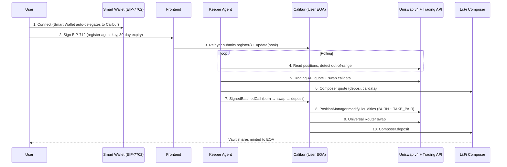
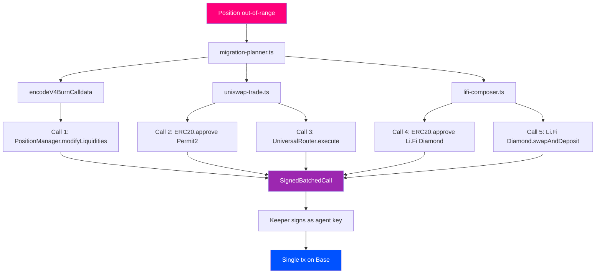

<p align="center">
  
</p>

<h1 align="center">Moai</h1>

<p align="center">
  Autonomous Uniswap LP rebalancer — delegate once, your Uniswap positions never go idle again.
</p>


---

MOAI is an agentic liquidity manager built on top of **Uniswap v3 + v4**. Users delegate to a keeper agent with a single EIP-712 signature; the agent watches their Uniswap positions and, when one drifts out of range, **atomically burns the LP via the Uniswap v4 PositionManager**, **swaps the proceeds through the Uniswap Trading API + Universal Router**, and re-deploys capital into the highest-yielding Li.Fi Earn vault that matches the user's risk profile — all in one signed batch on Base, with the relayer paying gas. Uniswap is the substrate; the agent is the worker that keeps it productive.

---

## What Makes MOAI Special

### Who This Is For

Meet Andre. He's been LP'ing on Uniswap v4 since launch, sitting on $40k of concentrated ETH/USDC liquidity. The fees were great — for the first two weeks. Then ETH ripped 22% in a day, his range got blown out, and his position has been earning exactly zero since.

Andre knows what he _should_ do: burn the LP, rebalance, redeploy. But that means tracking 6 separate positions across two chains, watching prices at 3am, paying gas on every leg, and trusting himself to not click the wrong button on the v4 PositionManager. So instead, he just… leaves it. Idle. For weeks.

He tried JIT bots — too aggressive, ate his fees. He tried a "set-and-forget" yield aggregator — they don't even support v4. He tried automating it himself with Foundry scripts — works for one position, breaks the moment he adds a second.

Andre's problem isn't a missing tool. It's that there's no platform where an autonomous agent _watches his positions_, _decides when to act_ based on his risk profile, and _executes a multi-leg migration_ in one atomic batch — without him surrendering custody of his funds.

---

### The Problem

Concentrated liquidity is a part-time job. Once a Uniswap v3/v4 position drifts out of its tick range, fees stop accruing immediately — but capital stays locked, earning nothing. The LP has to actively burn, swap, and redeploy to either a new range or a different yield source. That's three transactions, three approvals, three gas payments, and a real risk of a fat-finger somewhere along the way.

The existing tooling falls short:

- **Manual rebalancing** — gas-expensive, time-sensitive, requires the LP to be online and paying attention 24/7
- **Custody-based vaults** (Arrakis, Gamma, etc.) — user surrenders the LP NFT to a smart-contract vault; lose direct ownership, opt-in to the vault's strategy, can't migrate to non-Uniswap yield
- **JIT/MEV bots** — aggressive, often eat into LP fees, not aligned with passive holders
- **Single-purpose scripts** — work for one wallet, one pair, one strategy; break the moment scope expands

And none of them coordinate execution across users to get a better swap quote, or use a session-key model where the user retains full ownership.

**How might we build an LP-management agent that runs autonomously, executes complex multi-leg migrations atomically, and never holds the user's funds?**

---

### The Solution

MOAI solves this with five core primitives built on top of the Uniswap stack:

**1. EIP-7702 Session Keys via Calibur** — One EIP-712 signature registers a 30-day keeper key on the user's EOA via the **Calibur singleton — Uniswap's official EIP-7702 implementation** (`0x000000009B1D0aF20D8C6d0A44e162d11F9b8f00`). No on-chain delegation tx, no gas. The key is scoped by a `CaliburExecutionHook` that whitelists exactly the Uniswap PositionManager + Universal Router selectors MOAI is allowed to execute.

**2. Atomic Uniswap-Native Migration** — When a position goes out of range, MOAI builds a `SignedBatchedCall` containing all legs: native **Uniswap v4 actions (`BURN_POSITION` 0x03 + `TAKE_PAIR` 0x11 + `SWEEP` 0x14 for ETH-native pools)** → ERC20 `approve` for Permit2 → **Uniswap Trading API `/quote` + `/swap` calldata routed through Universal Router** → `approve` Li.Fi → vault deposit. The user's wallet stays untouched; one transaction, one tx hash, one BaseScan link.

**3. Risk-Profile-Driven Vault Selection** — Three profiles (Conservative / Balanced / Aggressive) drive a different protocol allowlist for the destination Earn vault. Conservative routes to the highest-TVL bluechip (Aave, Compound, Lido); Balanced picks best APY across Morpho/Aave/Compound; Aggressive maximizes yield across Pendle, Ethena, Yearn, Euler, EtherFi.

**4. Relayer-Funded Gas** — A keeper hot wallet submits the batched tx and pays gas. The user's EOA pays nothing for the migration itself — fees are deducted from accrued LP fees / yield over time, not from principal.

**5. Funds Never Leave Custody** — Calibur runs as the user's EOA bytecode under EIP-7702. There is no smart-contract vault holding LP NFTs, no proxy custodian, no withdrawal queue. The agent has a key; the user always owns the EOA.

---

## Features

- **One-Signature Delegation via Calibur (Uniswap's EIP-7702)**: Register the agent in 30 seconds using Uniswap's official 7702 singleton — no on-chain tx, no gas, 30-day auto-expiry, revoke anytime
- **Atomic Uniswap-Native Migration Batches**: Burn LP via v4 PositionManager → swap via Universal Router → deposit, all in one transaction via Calibur's `SignedBatchedCall`
- **Full Uniswap v3 + v4 Coverage**: Position discovery via The Graph (Uniswap subgraph) + Uniswap Public GraphQL + on-chain PositionManager reads; v4 burn calldata encoded with native action enums (`BURN_POSITION` 0x03, `TAKE_PAIR` 0x11, `SWEEP` 0x14 for ETH-native pools)
- **Uniswap Trading API as the Swap Engine**: `/check_approval`, `/quote`, and `/swap` endpoints route every migration through the Universal Router with CLASSIC routing across V3+V4 pools and 0.5% slippage
- **Uniswap Pool Stats Live in UI**: TVL + 24h volume + APR range pulled from Uniswap's Public GraphQL `topV4Pools` query, refreshed per position
- **Risk-Aware Routing**: Three risk profiles with distinct protocol allowlists guarantee meaningfully different vault selections per user preference
- **One-Click Create on Uniswap**: Direct link to `app.uniswap.org/positions/create/v4` so users can spin up a new LP and have MOAI track it instantly
- **Live Activity Feed**: Real-time keeper tick stats, last-check timestamps, and per-position migration history
- **Animated UX**: Lottie-driven success / agent-active / migration-plan animations for tactile feedback
- **Dark Mode**: Full theme support with persisted preference, no FOUC, brand-aware gradients
- **Withdraw Flow**: Redeem any vault holding back to USDC in your wallet, atomically via Li.Fi Composer

---

## Tech Stack

| Layer | Technology |
|---|---|
| Frontend | Next.js 16, React 19, TypeScript, Tailwind CSS v4 |
| State | Zustand (with persist middleware for theme + settings) |
| Wallet Integration | wagmi + RainbowKit + viem 2.48 |
| Wallet Support | Uniswap Smart Wallet (EIP-7702), Coinbase Smart Wallet, MetaMask |
| Blockchain | Base Mainnet (chainId 8453) |
| Smart Account | Calibur singleton (Uniswap's official EIP-7702 implementation) |
| Smart Contracts | CaliburExecutionHook, GuardedExecutorHook (Solidity, Foundry) |
| Swap Routing | Uniswap Trading API + Public GraphQL + The Graph subgraph |
| Yield Source | Li.Fi Earn API + Li.Fi Composer (35+ Base vaults across Morpho, Aave, Pendle, Ethena, etc.) |
| Animation | Lottie (lottie-react), Framer Motion |
| Toast | Sonner (custom-rendered tx toasts) |

---

## Uniswap API Integration

MOAI is built directly on top of the **Uniswap Trading API**, **Uniswap Public GraphQL**, **Uniswap subgraph**, and **Calibur (Uniswap's EIP-7702 singleton)**. Every migration is calldata produced by Uniswap-owned APIs and executed by user-owned EOAs. Here are the core integration points:

| Component | File | Description |
|---|---|---|
| **Trading API Client** | `services/server/uniswap-trade.ts` | Calls `/check_approval`, `/quote`, `/swap` on `trade-api.gateway.uniswap.org/v1` to produce the Permit2 approve + Universal Router swap calldata for every migration |
| **v4 Pool Stats** | `services/server/uniswap-v4-stats.ts` | Queries `topV4Pools` on Uniswap's Public GraphQL to power TVL + 24h volume + APR display per position |
| **Position Discovery** | `services/server/positions-subgraph.ts` | Pulls user's Uniswap v3 NFT positions from The Graph using Uniswap's official subgraph (`HMuAwufqZ1YCRmzL2SfHTVkzZovC9VL2UAKhjvRqKiR1`) |
| **On-Chain Reader** | `services/server/positions-onchain.ts` | Reads PositionManager v3/v4 directly via viem to verify in-range / out-of-range status and current liquidity |
| **v4 Burn Encoder** | `services/server/calldata-encoders.ts` | Encodes `modifyLiquidities` with native v4 actions: `BURN_POSITION` (0x03) + `TAKE_PAIR` (0x11) + `SWEEP` (0x14) for ETH-native pools |
| **Migration Planner** | `services/server/migration-planner.ts` | Orchestrates Trading API quote/swap + v4 burn + Li.Fi deposit into one `SignedBatchedCall` |
| **Calibur Typed-Data** | `lib/calibur/eip712.ts` | EIP-712 typed-data envelopes for `SignedBatchedCall` against Uniswap's Calibur singleton (`0x0000…f00`) |
| **Calibur ABI + Builder** | `lib/calibur/abi.ts` + `services/server/calibur.ts` | Builds and signs registration / migration / revocation batches that execute as the user's EOA via EIP-7702 |
| **Plan Endpoint** | `app/api/migrate/plan/route.ts` | Server-side endpoint that returns a fully-built atomic Uniswap-native migration plan, ready to sign |
| **Migrate Now Endpoint** | `app/api/agent/migrate-now/route.ts` | Backend executor that signs the plan as the agent key and relays `Calibur.execute` to user's EOA |
| **Position Card** | `components/pages/(dashboard)/PositionsGrid/PositionCard.tsx` | Live UI for each Uniswap LP — pool stats, status, **View position** deep-link to `app.uniswap.org/positions/v4/base/{tokenId}` |
| **Create New Position** | `components/pages/(dashboard)/PositionsGrid/PositionsHeader.tsx` | One-click CTA to `app.uniswap.org/positions/create/v4` so users can spin up an LP and have MOAI track it instantly |

### Uniswap Endpoints API in Use

| API | Endpoint | Purpose |
|---|---|---|
| Trading API | `POST /v1/check_approval` | Detects whether user already has a sufficient Permit2 allowance; returns approve calldata if not |
| Trading API | `POST /v1/quote` | Best route + expected output for `tokenIn → USDC` across V3+V4 pools, CLASSIC routing, 0.5% slippage |
| Trading API | `POST /v1/swap` | Produces the final calldata to **Universal Router** for the swap leg of the batched migration |
| Public GraphQL | `POST https://api.uniswap.org/v1/graphql` (`topV4Pools`) | Per-pool TVL + 24h volume to compute APR Range and decorate position cards |
| The Graph | `https://gateway.thegraph.com/api/.../subgraphs/id/...` | Uniswap v3 position discovery (NFT IDs, ranges, fees, pair) for the connected wallet |
| EIP-7702 | Calibur singleton `0x000000009B1D0aF20D8C6d0A44e162d11F9b8f00` | Uniswap's official 7702 implementation — runs as user's EOA bytecode for atomic batched calls |

---

## Architecture

### System Flow



### Calldata Pipeline




## Setup

### Smart Contract Setup

```bash
# Install Foundry
curl -L https://foundry.paradigm.xyz | bash
foundryup

# Clone the repository
git clone https://github.com/0xpochita/moai.git
cd moai/contracts

# Build
forge build

# Deploy CaliburExecutionHook to Base
./deploy.sh
```

### Frontend Setup

```bash
cd moai/frontend

# Install dependencies
pnpm install

# Configure environment variables
cp .env.example .env.local
# Edit .env.local:
#   NEXT_PUBLIC_WALLETCONNECT_PROJECT_ID=your_wc_project_id
#   NEXT_PUBLIC_CALIBUR_HOOK_ADDRESS=0x...        (deployed hook)
#   NEXT_PUBLIC_BASE_RPC_URL=https://base.drpc.org
#   UNISWAP_API=your_trading_api_key
#   LIFI_API_KEY=your_lifi_key
#   THEGRAPH_API_KEY=your_thegraph_key
#   KEEPER_PRIVATE_KEY=0x...                       (relayer hot wallet, must hold ETH on Base)

# Start development server
pnpm dev
```

Open [http://localhost:3000](http://localhost:3000) in your browser.

---

## How It Works

### User Flow (LP Owner)

```
Connect Wallet → Delegate (1 signature) → Pick Risk Profile → Watch Agent → Receive Migration Tx
```

1. **Connect Wallet** — Uniswap Smart Wallet or Coinbase Smart Wallet (auto-delegates the EOA to Calibur on first tx)
2. **Delegate** — sign one EIP-712 typed-data envelope; relayer submits `register()` + `update(hook)` for free
3. **Pick Risk Profile** — Conservative / Balanced / Aggressive (drives destination vault selection)
4. **Watch** — dashboard shows live positions, holdings, agent status (Watching / Connecting), last keeper tick
5. **Receive** — when a position goes out-of-range, agent migrates it; user sees a toast with BaseScan link to the batched tx

### Agent Flow (Keeper)

```
Poll Positions → Detect Out-of-Range → Build Plan → Sign as Agent → Relay
```

1. **Poll** — every 60s (Premium: 30s) the keeper reads each subscribed user's Uniswap positions on-chain
2. **Detect** — flags any position whose current tick is outside `[tickLower, tickUpper]`
3. **Plan** — builds a `MigrationPlan`: burn calldata + Trading API swap calldata + Li.Fi Composer deposit calldata
4. **Sign** — wraps all legs in a `SignedBatchedCall` with `keyHash = agentKey`, signs with the keeper private key
5. **Relay** — submits to user's EOA address (Calibur lives at user's bytecode under EIP-7702); keeper pays gas

### On-Chain Flow

```
User EOA (Calibur)              Relayer                     Protocols
   │                               │                            │
   ├── Smart Wallet auto-delegates │                            │
   │                               │                            │
User signs typed-data ─────────►   │                            │
   │                               ├── relays register/update ──►│ (User EOA bytecode)
   │                               │                            │
Keeper signs SignedBatchedCall ─►  │                            │
   │                               ├── execute() on User EOA ──►│
   │                               │     ├── BURN_POSITION ────►│ Uniswap v4 PositionManager
   │                               │     ├── SWAP ─────────────►│ Uniswap Universal Router
   │                               │     └── DEPOSIT ──────────►│ Li.Fi Diamond → Vault
   │                               │                            │
   ◄── Vault shares + dust ETH refunded to User EOA ───────────│
```

---

## Smart Contract Details

### Contract Addresses (Base Mainnet)

| Contract | Address | Description |
|---|---|---|
| `CaliburExecutionHook` | configured via `NEXT_PUBLIC_CALIBUR_HOOK_ADDRESS` | Per-key validator that whitelists the function selectors MOAI's keeper is allowed to invoke |
| `Calibur` | `0x000000009B1D0aF20D8C6d0A44e162d11F9b8f00` | Uniswap's official EIP-7702 singleton — runs as user EOA bytecode |
| `PositionManager v4` | `0x7C5f5A4bBd8fD63184577525326123B519429bDc` | Uniswap v4 NFT manager (burn target) |
| `Universal Router` | from Trading API response | Uniswap swap entrypoint |
| `Li.Fi Diamond` | `0x1231DEB6f5749EF6cE6943a275A1D3E7486F4EaE` | Li.Fi Composer (deposit target) |

### Key Functions

#### CaliburExecutionHook

```
beforeExecute(keyHash, calls)                           — Validates each Call's (to, selector) is in the keyHash's allowlist
addToAllowlist(keyHash, target, selector)               — Owner adds an allowed (target, selector) pair
removeFromAllowlist(keyHash, target, selector)          — Owner revokes an allowance
```

#### Frontend service modules

```
buildRegistrationBatch(userEoa, agentAddr, hookAddr)    — typed-data for one-shot delegation
buildAgentBatch(userEoa, calls)                         — typed-data for migration / withdrawal
relaySignedBatch(userEoa, signedBatchedCall, sig)       — relayer submits Calibur.execute
encodeV4BurnCalldata({tokenId, currency0, currency1})   — v4 burn with native pool SWEEP support
```

> For full integration details and EIP-712 envelope structure, see [`frontend/src/lib/calibur/`](./frontend/src/lib/calibur/).

---

## Hackathon Submission

| | |
|---|---|
| **Event** | ETHGlobal Hackathon |
| **Track** | Uniswap: Best Uniswap API Integration |

---

## License

MIT

---

> Your liquidity should never sleep — MOAI